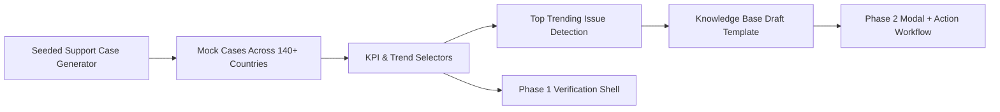

# Pacera Support Nexus

Pacera Support Nexus is a high-fidelity mock support-operations application designed for a Head of Support interview scenario. The concept is built around Pacera's three-product finance software landscape:

- `Aico` for close automation
- `AARO` for consolidation and group reporting
- `Mercur` for planning and forecasting

This repository is currently implemented through **Phase 1** of the agreed plan: project setup, deterministic mock-data generation, KPI selectors, trend detection, and a verification shell that proves the data layer before the polished dashboard is built.

## Why this app exists

The app is meant to demonstrate:

- Strategic support leadership across a multi-product SaaS portfolio
- Operational rigor around SLAs, backlog, escalation, and follow-the-sun coverage
- AI-forward support thinking through proactive insight detection and KB generation
- A narrative that aligns with Debayan's experience in AI support transformation, escalation governance, and global support operations

## Current status

Phase 1 is implemented now.

- Deterministic support cases are generated across 140+ countries and 30 days
- Mock tickets span Zendesk and Salesforce
- Product-specific finance issues are modeled for Aico, AARO, and Mercur
- KPI selectors produce CSAT, SLA adherence, average resolution time, backlog, and escalation rate
- A trend engine identifies the top growing issue and seeds a future KB workflow
- The app exposes a verification-first shell instead of the final polished dashboard

Phase 2 is intentionally pending user confirmation, per the source prompt.

## Architecture

The project is intentionally separated into domain, selector, content, and UI layers.

- `app/`
  - Next.js App Router entrypoints
  - Phase 1 renders a verification shell only
- `components/phase-one/`
  - Filter controls, KPI rendering, case table, and verification panels
- `lib/mock-data/`
  - `types.ts`: domain contracts
  - `constants.ts`: country coverage, issue catalog, product metadata
  - `rng.ts`: deterministic seeded RNG
  - `generator.ts`: support-case synthesis
  - `selectors.ts`: KPI rollups, routing summaries, regional coverage, and insight detection
- `lib/content/`
  - `insights.ts`: KB draft generation from detected support trends
- `test/`
  - Node-based tests for generator determinism, filters, and trend detection

## Mock-data strategy

The seeded generator creates realistic support workload across a 30-day operating window.

- Coverage: 140+ countries across `Nordics`, `Europe`, `North America`, `LATAM`, `MEA`, and `APAC`
- Sources: `Zendesk` and `Salesforce`
- Finance-specific issues include:
  - month-end close sync failures
  - journal workflow stalls
  - consolidation mismatches
  - FX anomalies
  - forecasting model access problems
  - planning latency
- Support fields include:
  - product
  - issue type
  - region and country
  - escalation tier
  - routed team
  - SLA status
  - time to resolve
  - CSAT
  - backlog state

The generator deliberately injects a late-window surge in `Month-end close sync failure` for `Aico` in Europe and the Nordics so the insight engine has a believable operational signal to detect.

## KPI definitions

- `CSAT`: average case satisfaction normalized to percentage from a 5-point score
- `SLA Adherence`: share of cases that met their SLA target
- `Avg Resolution`: average hours to resolve across completed cases
- `Active Backlog`: count of open cases still unresolved at the end of day
- `Escalation Rate`: share of cases reaching Tier 2 or Tier 3

Each KPI also computes:

- a seven-day sparkline
- a prior-seven-day comparison window
- percentage change between the two windows

## Insight engine

The Phase 1 insight layer:

- compares recent 7-day issue volume against the prior 7-day window
- finds the top-growing issue by product and region
- produces an operational summary and recommendation
- generates a draft knowledge-base structure for future use in the Phase 2 modal flow

This is a local rule-based system today, not an LLM integration.

## Local development

Use `npm` in this project directory.

```bash
npm run dev
```

Open `http://localhost:3000`.

Available scripts:

```bash
npm run dev
npm run lint
npm run test
npm run build
```

## Test coverage

The repository includes lightweight unit tests for:

- deterministic seeded generation
- country/product coverage
- filter-aware snapshot derivation
- trending issue detection

The tests use Node 22's TypeScript stripping support and the built-in Node test runner.

## Vercel notes

The application is App Router compatible and requires no external services for Phase 1.

- No environment variables are required
- No database is required
- No API keys are required
- Deployment target can be Vercel with default Next.js settings

## Workflow



## Acceptance checkpoints completed in Phase 1

- New writable Next.js application scaffolded under `applications/pacera-support-nexus`
- Deterministic mock-data layer implemented
- Filter-aware selectors implemented
- Insight and KB-draft scaffolding implemented
- Verification UI implemented
- Tests added for the data foundation

## Next step

Phase 2 should replace the verification shell with the polished interview dashboard after explicit user confirmation.
